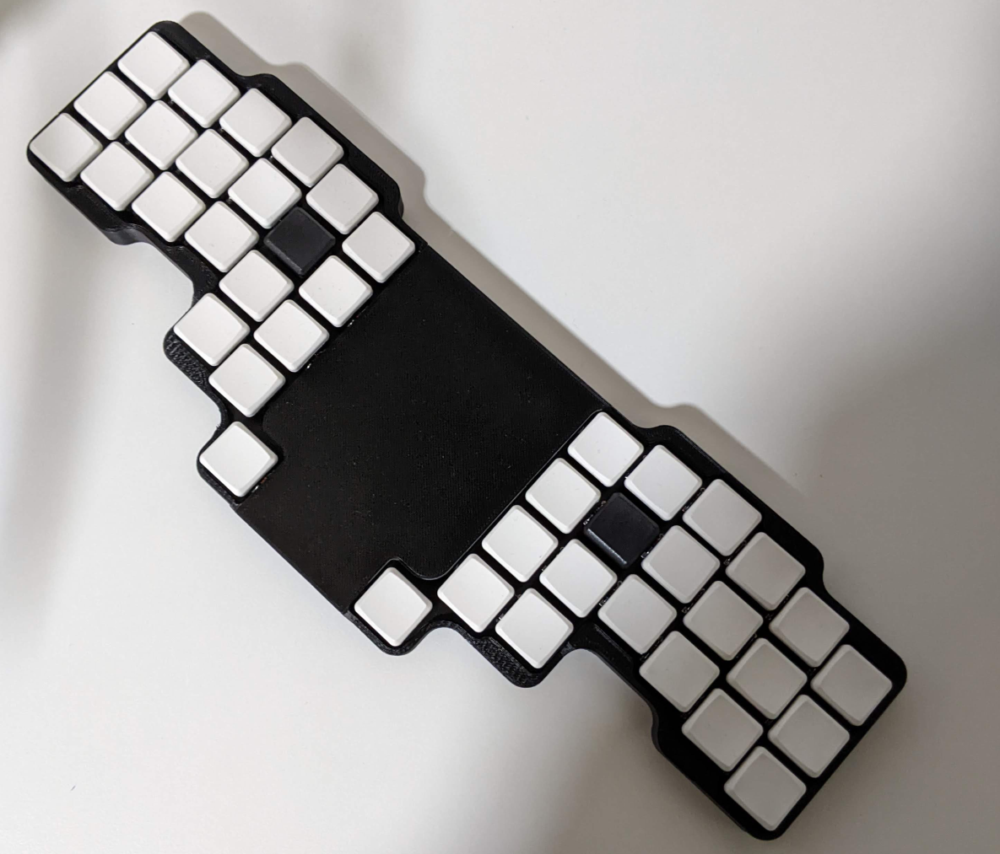
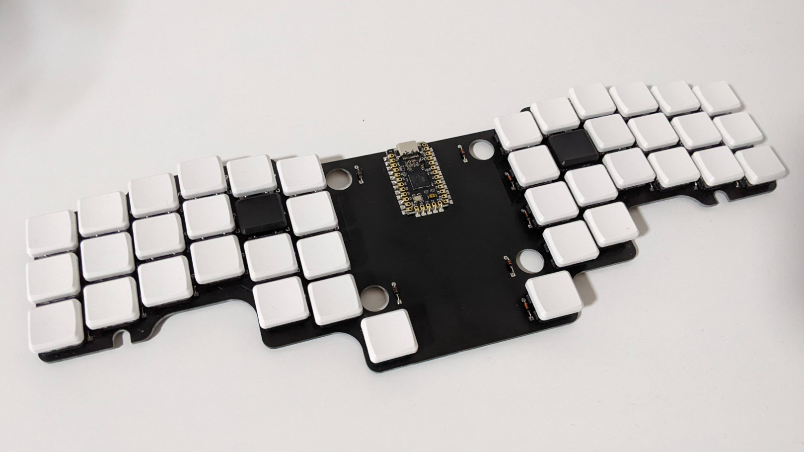
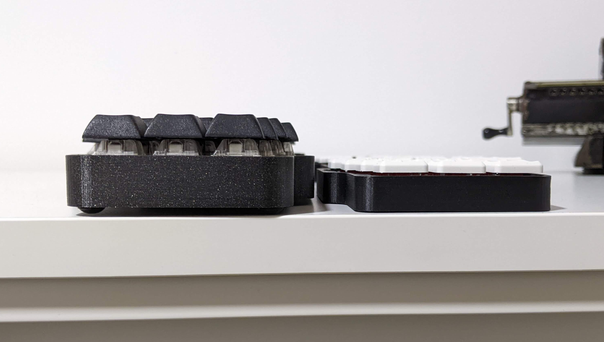

# 42 Keyboard

A 40% mechanical keyboard.

## Features

- 40% – Each key is at most one unit of distance from where the finger that
  should press it rests. In other words there's no awkward reaching for keys
  that are placed far from the home row.
- Staggered columns - Because a comfortable keyboard should follow the shape of
  your hands.
- Low profile - The PCB supports Choc (PG1350) switch mounts as well as Cherry MX/Alps.

## Pics

- Finished keyboard
   
- PCB
   
- Height comparison between v3 and v3.1
   

## Project Structure

- [Build](./build/README.md) – Build log, bill of materials, tips on where to
  source parts, assembling tips, learning resources I used while designing this
  keyboard.

- [Case](./case/README.md) – Fusion 360 project and STL files for 3D printing
  the enclosure.

- [Firmware](./firmware/README.md) – QMK configuration. There is a Makefile to
  build and load the firmware.

- [PCB](./pcb/README.md) – Kicad project and Gerber files for manufacturing the
  circuit board.

## Why?

In January 2018 I wanted a keyboard with a specific set of features. The
simplest options to get that keyboard were to wait for a group-buy or build my
own. Waiting time and costs for both options seemed similar, so I went with the
option where I would learn the most.

Needs and knowledge changed over time, so I made different iterations to add new
features and account for the lessons learned from previous builds.

## Feedback

If you have some feedback or questions, feel free to [create an issue](https://github.com/nglgzz/42/issues/new). Your input is more than welcome!

## Previous Versions

- [version 3](https://github.com/nglgzz/42/tree/rev-3) –
  PCB, QMK, Bluetooth, micro USB
   
- [version 2](https://github.com/nglgzz/42/tree/rev-2) –
  Handwired, QMK, Bluetooth, micro USB
   
- [version 1:](https://github.com/nglgzz/42/tree/rev-1)
  PCB, Split, TMK firmware, USB C
   
