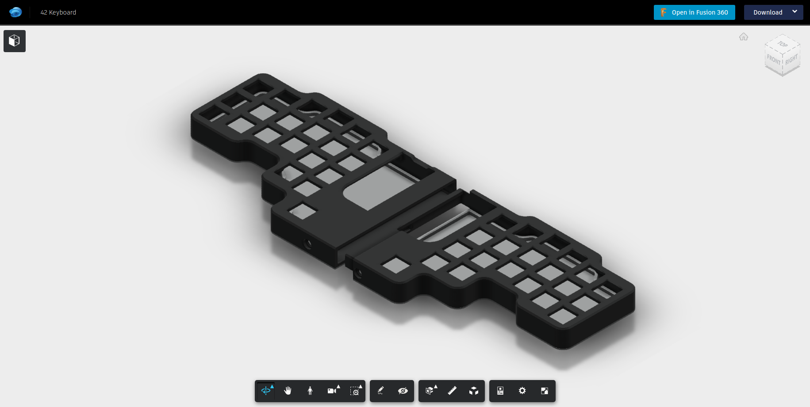

# [42 Keyboard](../README.md) – Case

## STL Files

At the moment you can download the STL files through the Fusion 360 link below.
I will add them here as well once I have a working design.

## Fusion 360

You can view or download the Fusion 360 [project here](https://a360.co/3c8QJz9).

## 3D printing

For the best result, 3D print all parts face down and generate supports only
for angles steeper than 45 degrees. This will ensure minimal cleanup, a smooth
surface on both the top and bottom and optimal strength.

## Useful Resources

[../build/resources.md](../build/resources.md#case)
