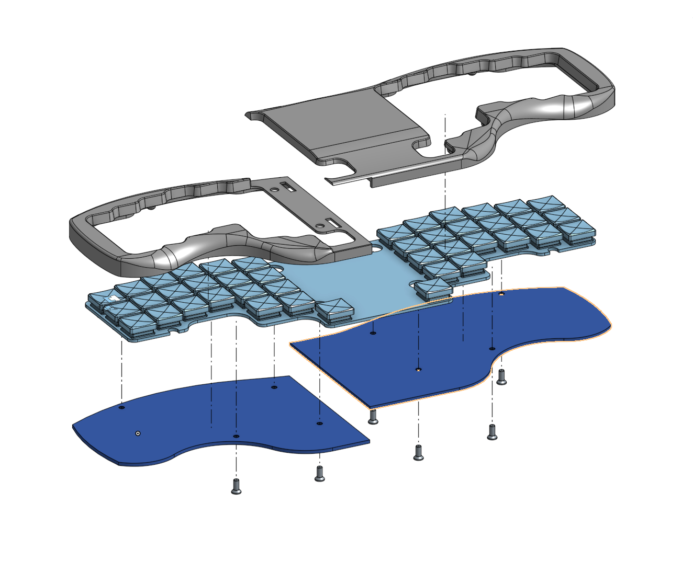

# [42 Keyboard](../README.md) – Case

The enclosure is made of two parts, top and bottom. Each can be 3D printed in
one piece, if your machine has the print volume for it, or they can be printed
in "halves".

When 3D printing I've had the best result by printing the top with organic
supports and at a 45 degree angle (with the thumb keys edge touching the print
bed, and the USB connector edge being furthest away from the print bed).

The top side has holes for M3 (5mm height, 5mm external diameter) heat set
inserts, and the two sides are meant to be assembled with M3x8mm countersunk bolts.

Below is a simplified version of the assembly (missing the micro-controller and
heat set inserts).

## Onshape project

[The Onshape project can be viewed here.](https://cad.onshape.com/documents/cb8004757ac706cd9c775f57/v/fec0d55d4a8dead62aa5ec49/e/c6679b585992e23092c8d566?renderMode=0&uiState=69d0fe57e7d753b0f5cca13d)
Through this link you can also export the various parts in different formats and
"fork" the project to make changes to it.

## Bottom plate

Since the bottom is a simple 2D plate, it could be manufactured through laser
cutting instead of 3D printing. I added a .step file for that use case.

Note that if laser cutting, the holes will need to be manually countersunk for
the bolts to sit flush with the bottom of the keyboard. Also if manufacturing
the plate out of sheet metal, an insulation layer between the back of the PCB
and the bottom plate will be needed to prevent short-circuits, and that might
increase the total height of the keyboard.

## Useful Resources

[../build/resources.md](../build/resources.md#case)
